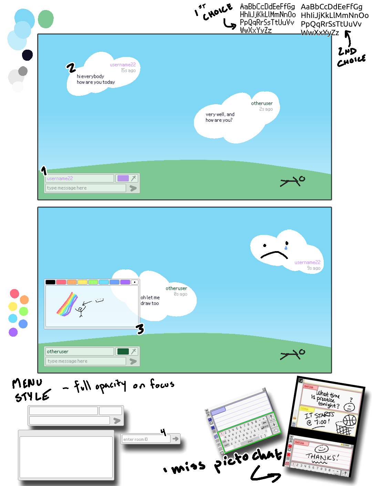

# Assignment 5

> To initialize, build, and run this project, please use:
>   ```sh
>   npm i
>   npm run build5
>   npm run run5
>   ```

## Introduction

Please note: this project is copied over from a school assignment. This README will be changing drastically in the near future.


- [Concept](#concept)
    - [Mockup drawing](#mockup)
    - [Project structure](#project-structure)
    - [Data design](#data-design)
- [Issues](#issues)
    - [Client-side](#client-side)
    - [Server-side](#server-side)
- [Attributions](#attributions)


## Concept

For this project, I want to get some experience with realtime interactions via websockets, and I've chosen [SocketIO](https://socket.io/) to use for socket management/framework/general guidance.

My initial concept for the site is a simple realtime messenger app. The gimmick is clouds drifting through a blue sky. The few menus there are can be dragged around and organized as desired by the user. When messages are sent, they appear as clouds for about 30 seconds before fading away.

Immediate concerns:
- May require a whole different layout on mobile.
- Definitely not a practical concept, nor would it be fun on a large scale or for serious use.
- Which animations should be JS and which should be CSS?

Despite concerns, I think it is a fun concept I know I and friends would play with, and more than that, I want to work with websockets. I will call this site "Cloudfaire", a play on "Cloudflare".


### Mockup



Some notes on my mockups:

1. The user will primarily interact with the site through this input box. There is a space for their username to go, a color to identify themself by, and an input box for the actual text they would like to send. The username and color is editable at any time, as I don't intend to deal with account creation for this project.

2. When sent, the message is broadcast to the room, and displays as a cloud. The cloud will fade in, drift, and fade out.
    - While I'll enforce a character limit, displaying text and image on little clouds might look goofy from time to time.

3. I want to create a small window for creating and sending a drawing with a limited size and color palette. I think that would be a fun challenge.

4. I think it would be a good challenge to implement a feature where multiple chat rooms can be created and used. This prototype would be the window via which a user joins a room -- a separate menu would create a room.

A few aspects of this project -- the draggable windows and a canvas you can draw on -- are things that I have written before, and will be easy to copy my old work and modify as needed. 


### Project Structure

After some basic research into common structures of NodeJS servers, I have decided to adopt the following structure:

```
site/
├── config/
│   └── config.ts
├── controllers/
│   └── sockets.ts
├── models/
│   └── interfaces.d.ts
├── public/
│   ├── css/
│   ├── fonts/
│   ├── img/
│   ├── scripts/
│   ├── index.html
│   └── tsconfig.json
├── server.ts
└── tsconfig.json
```

`config/config.ts` is home to basic server-side configuration. 

`controllers/socket.ts` is home to server-side socket behavior (reactions on events, etc).

`models/interfaces.d.ts` is home to Typescript interfaces for guidance throughout both sides of the application.

`public/` is home to all static files available to the client. `public/scripts/app.ts` is the one script called by `index.html`, which imports all other necessary scripts. `public/tsconfig.json` configures behavior for the compilation of client-side code, given the differences in regard to code run by NodeJS as opposed to the browser (for instance, no access to a DOM, and access to Node modules).


### Data Design

`public/scripts/` holds scripts for the client-side application. This is where most of the work is done in this project, as it contains the behavior of draggable windows and clouds, user input validation, and more.

Overall, there is not too much complexity to the data design. The main data model I had to design was the messages themselves, given the role they play on both sidess of the application. After a few iterations, I settled on this:

```ts
interface Message {
    message: string;  // Actual message content.
    username: string;  // The user's display name.
    color: string;  // The user's custom color.
    imageData: string;  // Data URL for the user's drawing.
}
```
> Note: In `interfaces.d.ts`, this model is labelled `BaseMessage`, and there are two interfaces that extend it without actually making additions: `ClientMessage` and `ServerMessage`. This is because during one iteration of this project, the server altered the datatype of a field. Though this is no longer true, I kept these classes to remind myself that the concept may have an appropriate use someday: it makes sense that the data broadcasted by the server elaborates on the data delivered by the client.

On the client side, these values are gathered from `input` elements and sent through input validation before being sent to the server. In certain cases (if the user is not connected to a specific room), the server replies with an error message for the client to display as a toast-like popup.


## Issues

### Client-side

- Canvas: After loading/reloading the page, the first stroke on the canvas aborts after about a half-second.
    - This is not prevented by clicking before drawing.
    - If the first stroke is less than the approximate half-second, the next stroke will cut off after the remainder of that approximate half-second of draw time.
    - Every stroke after works perfectly as expected, even after canvas reset.
    - Update: I do not have this issue on my laptop.

- Some clouds aren't perfectly sized and have minor clipping on the top and bottom due to inconsistent SVG sizes. I don't think it's worth fixing, but I wanted to make note.


### Server-side

- Not a distinct issue, but: using SocketIO was much easier than expected, resulting in incredibly simple server-side scripts. I wanted to show that I know more about server-side coding than this, but I ended up spending a lot of time working on the client-side part of this. I hope to make something more interesting and server-oriented for my final.


## Attributions

In this project, I again use a handful of SVG files from [SVGRepo.com](https://www.svgrepo.com) that require attributions. I use these files and have made note of any changes.

- [Arrow SVG](https://www.svgrepo.com/svg/469643/right-arrow)
- [GitHub SVG](https://www.svgrepo.com/svg/521688/github)
- [Help SVG](https://www.svgrepo.com/svg/507736/help) -- altered viewbox to enlarge and removed color.
- [Send SVG](https://www.svgrepo.com/svg/327524/send)
- [Settings SVG](https://www.svgrepo.com/svg/509221/settings) -- also altered viewbox.
